# Bootstrap-Ablauf (`scripts/bootstrap.sh`)

Grafische Struktur des VPS-Bootstraps. Macht einen frischen Ubuntu-VPS
(22.04 / 24.04) produktionsbereit: User `alex` + Docker + Bitwarden CLI,
Repo clonen, GPG-Passphrase aus Bitwarden holen, `.env` entschlüsseln,
Container starten, Cloudflare reconcilen, Nightly-Backup-Cron einrichten.

**One-liner (als root):**
```bash
curl -fsSL https://raw.githubusercontent.com/alexstuder-web/webPage_infra/main/scripts/bootstrap.sh \
  -o bootstrap.sh && chmod +x bootstrap.sh && ./bootstrap.sh
```

## Ablauf

```mermaid
flowchart TD
    start([curl … bootstrap.sh → ./bootstrap.sh<br/>als root])
    trap["set -euo pipefail<br/>trap 'rm -f $BW_PASS_FILE $PASS_TMP' EXIT<br/>(Secret-Cleanup-Netz)"]
    start --> trap

    trap --> pre{"PRE-FLIGHT<br/>EUID==0? · /etc/os-release? · ID==ubuntu?"}
    pre -- nein --> abort1((✖ exit))
    pre -- ja --> input

    input["EINGABEN (3× interaktiv, read -s)<br/>① BW E-Mail ② BW Master-PW ③ Linux-User-PW<br/>PW-Bestätigung + non-empty Check"]
    input --> sys

    sys["SYSTEM<br/>apt update/upgrade · curl git gnupg jq unzip ufw<br/>cron rclone · systemctl enable --now cron"]
    sys --> usr

    usr["LINUX-USER 'alex'<br/>useradd -u 1000 (idempotent) · chpasswd · -aG sudo"]
    usr --> dock

    dock["DOCKER<br/>apt keyring + repo · docker-ce + compose-plugin<br/>enable --now docker · usermod -aG docker alex"]
    dock --> bw

    bw{"BITWARDEN CLI<br/>snap install bw ?"}
    bw -- ok --> repo
    bw -- "fehlgeschlagen" --> bwdl{"$BW_ZIP_SHA256 gesetzt?"}
    bwdl -- nein --> abort2((✖ exit<br/>keine unverifizierte Binary))
    bwdl -- ja --> bwverify["Direkt-Download<br/>+ sha256sum -c (Pflicht)"]
    bwverify --> repo

    repo{"REPO CLONE / UPDATE (als alex)<br/>.git vorhanden?"}
    repo -- "ja + dirty" --> abort3((✖ abort<br/>uncommittete Änderungen))
    repo -- "ja + clean" --> reset["git fetch + reset --hard origin/main"]
    repo -- nein --> clone["git clone → /home/alex/webPage_infra"]
    reset --> secret
    clone --> secret

    subgraph SECRET["🔒 SECRET-FLOW — tempfiles mode 600, als alex · vom trap abgesichert"]
        direction TB
        secret["BW LOGIN + PASSPHRASE  [sudo -u alex bash]<br/>BW_PASS → BW_PASS_FILE<br/>login → unlock → BW_SESSION · bw sync<br/>bw get password $ITEM > PASS_TMP<br/>(VAR=$(cmd); export VAR — set -e failt korrekt)"]
        decenv["env ENTSCHLÜSSELN  [sudo -u alex bash]<br/>GPG_PASSPHRASE ← PASS_TMP<br/>./scripts/decrypt-env.sh (.env.gpg → .env)"]
        persist["PASSPHRASE PERSISTIEREN (für cron)<br/>install PASS_TMP → /etc/brewing/gpg.pass (alex, 600)<br/>rm -f PASS_TMP · dir 700 owner alex"]
        secret --> decenv --> persist
    end

    persist --> containers

    containers["CONTAINER STARTEN (als alex)<br/>docker compose --profile vps pull → up -d"]
    containers --> cf

    cf{"CLOUDFLARE RECONCILE<br/>.env hat CLOUDFLARE_API_TOKEN?"}
    cf -- ja --> cfrun["./scripts/cloudflare-reconcile.sh<br/>(Tunnel + DNS)"]
    cf -- nein --> cfskip["überspringen + Hinweis"]
    cfrun --> cron
    cfskip --> cron

    cron["NIGHTLY BACKUP-CRON (idempotent)<br/>rm alter sudoers-Drop-in<br/>/etc/cron.d/brewing-backup:<br/>0 3 * * * alex backup.sh ►► /var/log/brewing-backup.log"]
    cron --> done([✓ DONE — Status-/Log-/Restore-Cheatsheet])

    classDef guard fill:#fde,stroke:#c39,color:#600;
    classDef stop fill:#fdd,stroke:#c33,color:#600;
    class pre,bw,bwdl,repo,cf guard;
    class abort1,abort2,abort3 stop;
```



## Phasen-Typen

| Markierung | Bedeutung |
|---|---|
| **root-Phasen** | Pre-flight, Eingaben, System, User, Docker, bw-CLI, Passphrase-Persist, Cron — laufen als `root` |
| `[sudo -u alex bash]` | unprivilegierte Subshell (Repo, Secret-Flow, Container, Cloudflare) |
| 🔒 SECRET-FLOW | Zone, die der `trap … EXIT` (oben) absichert: bricht es hier ab, werden `BW_PASS_FILE` **und** `PASS_TMP` trotzdem gelöscht — keine Klartext-Passphrase bleibt in `/tmp` liegen |
| ✖ exit / abort | harte Abbruchstellen, wenn ein Guard fehlschlägt |

## Drei interaktive Eingaben

1. **Bitwarden E-Mail** + **Master-Passwort** — nur um die GPG-Passphrase
   (Item `ALEXSTUDER_WEBPAGE_GPG_PASSWORD`) aus dem Vault zu holen.
2. **Linux-User-Passwort** für `alex` (sudo + SSH danach).

Alles Weitere ist nicht-interaktiv. `alex` ist Mitglied von `docker` (→
`docker exec` ohne sudo) und Owner von `/etc/brewing/gpg.pass` (mode 600),
damit der Nightly-Backup-Cron die Passphrase ohne Prompt lesen kann.
